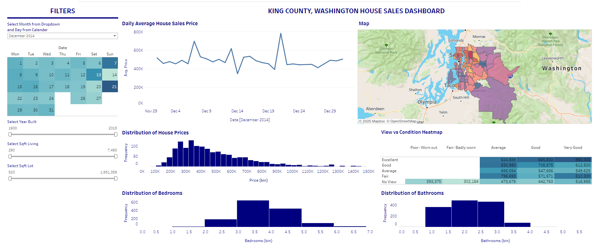

# King County, Washington House Sales Dashboard  

## 📊 Overview  
This Tableau dashboard provides a detailed analysis of house sales data in King County, Washington. It explores various aspects of the housing market, such as pricing trends, geographic distribution, and correlations between features like bedrooms, bathrooms, and house conditions. The goal of this project is to offer actionable insights into the real estate market for homebuyers, sellers, and analysts.  

---

## 🛠️ Tools and Technologies  
- **Tableau:** Used for creating visualizations and interactive dashboards.  
- **Data Source:** [ Kaggle, King County dataset,].  
- 

---

## 🔍 Key Features  
### 1. **Interactive Filters**  
   - **Date Picker:** Select specific months or days to explore sales trends over time.  
   - **Year Built Slider:** Filter houses by their construction year.  
   - **Sqft Living and Sqft Lot Sliders:** Narrow down homes by their size (living area or lot area).  

### 2. **Daily Average House Sales Price (Line Chart)**  
   - Displays daily trends in average house prices, revealing peaks and patterns over the selected period.  

### 3. **Geographic Map**  
   - A color-coded map visualizing house sales distribution across King County, showing spatial trends and price hotspots.  

### 4. **Distribution of House Prices (Histogram)**  
   - A histogram that highlights the frequency of house prices, helping identify common price ranges and outliers.  

### 5. **Distribution of Bedrooms and Bathrooms (Histograms)**  
   - Separate visualizations for the number of bedrooms and bathrooms in homes, showcasing their frequency and popularity.  

### 6. **View vs. Condition Heatmap**  
   - A heatmap showing the relationship between house condition (e.g., Poor, Good, Excellent) and the quality of the view (e.g., No View, Excellent View).  
   - Demonstrates how these features influence house prices.  

---

## 🌟 Key Insights  
- **Price Trends:** The daily price trends reveal fluctuations, with certain days showing higher average sales prices.  
- **Popular Configurations:** Homes with 3 bedrooms and 2 bathrooms are the most common, based on frequency distribution.  
- **Location Matters:** Certain regions in King County have significantly higher house sales or prices.  
- **View & Condition Correlation:** Houses with better conditions and excellent views command higher prices.  

---

## 📷 Dashboard Screenshot  
  

---

## 📂 How to Access  
1. **View on Tableau Public:** [(https://public.tableau.com/app/profile/dulaj.weerasinghe/viz/KingCountyHouseSales_17361150460170/KINGCOUNTYHOUSESALE)].   

---

## 📝 Future Enhancements  
- Add predictions or forecasting for future house sales using machine learning models.  
- Incorporate additional datasets, such as crime rates or school districts, for deeper analysis.  
- Expand the dashboard for comparative analysis across multiple counties.  

---

## 💡 About the Project  
This project showcases my ability to work with real-world data, create meaningful visualizations, and derive actionable insights. Feel free to reach out for feedback, collaborations, or suggestions!  
